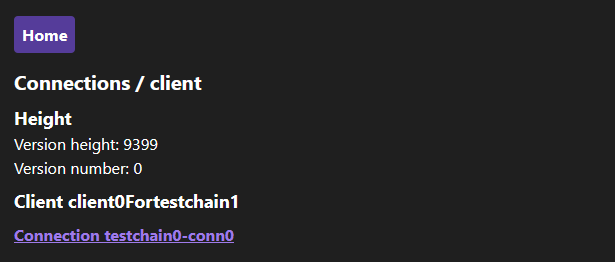
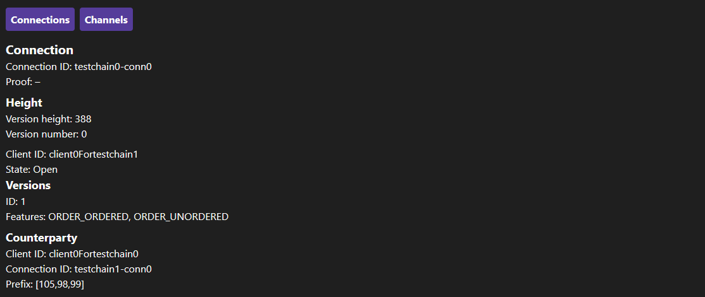
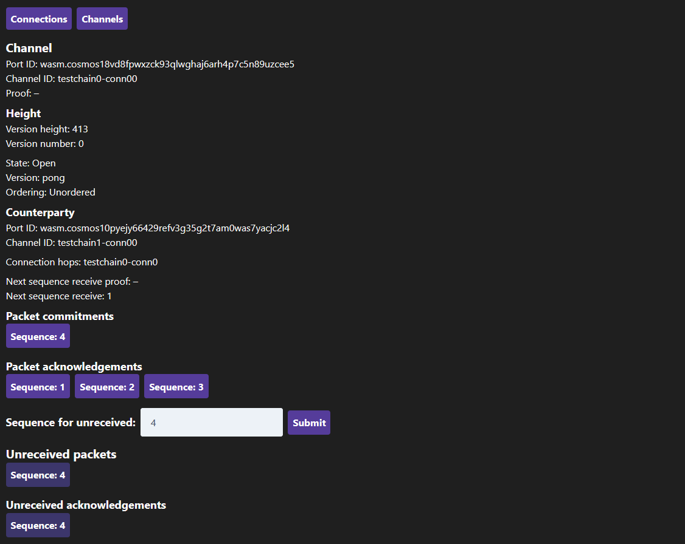
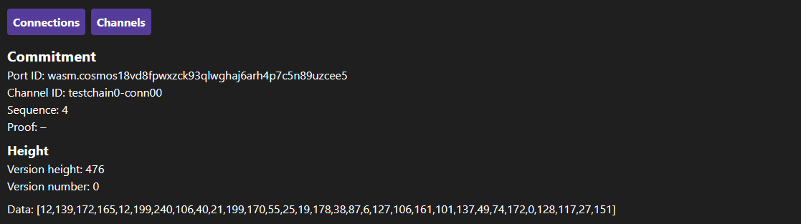
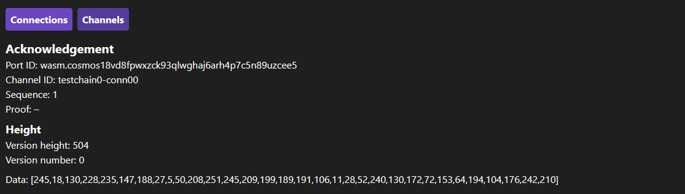

# IBC Visualizer

A visualizer for [IBC](https://github.com/cosmos/ics/tree/master/ibc) queries

## How to run local demo

The demo is Cosmos SDK `0.40.0-rc3` compatible, please follow these steps in order to run it:

1. Make sure Docker is installed on your system. This is needed to start a local blockchain.
2. Make sure `git-lfs` is [installed](https://docs.github.com/en/github/managing-large-files/versioning-large-files/installing-git-large-file-storage) on your system. This is needed to clone [cosmos/cosmjs](https://github.com/cosmos/cosmjs).
3. Start the CosmJS development blockchain "simapp":
   ```sh
   git clone https://github.com/cosmos/cosmjs.git
   cd cosmjs
   git checkout v0.24.0-alpha.10
   ./scripts/simapp/start.sh
   ```
3. Back in the `ibc-visualizer` repo root, run
   ```sh
   yarn install
   yarn start
   ```
   and follow the instructions in the terminal to access the app.

## Views

Every view has navigation breadcrumbs with links to the previous views.

### Connections

The `Connections` view lists all the connections grouped by client. Each listed connection is a link that redirects to the corresponding `Connection` view.



### Connection

This view shows details for the chosen connection and lists all its channels. Each listed channel is a link that redirects to the corresponding `Channel` view.



### Channel

This view shows details for the chosen channel.

The lists of packet commitments and acknowledgements have links that let the user go to the corresponding `Commitment` or `Acknowledgement` view.

There is a form for entering the sequence number with which to query the unreceived packets and acknowledgements.



### Commitment

This view shows details for the chosen commitment.



### Acknowledgement

This view shows details for the chosen acknowledgement.


