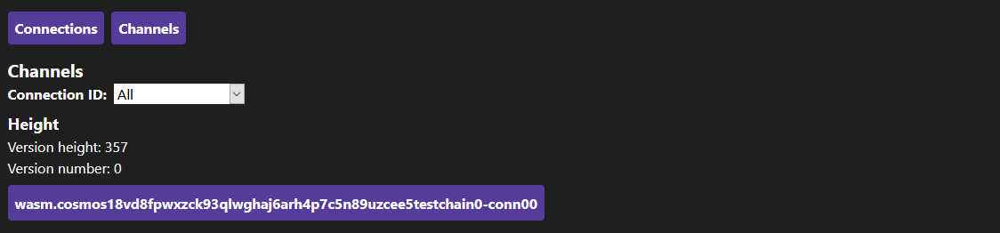

# IBC Visualizer

A visualizer for [IBC](https://docs.cosmos.network/master/ibc/overview.html) queries

## Views

Every view has two navigation buttons to the `Connections` and `Channels` view, and a `Height` section from the current query.

### Connections

The `Connections` view lists all the connections and lets the user filter by `Client ID`. Each listed connection is a button that redirects to the corresponding `Connection` view.

### Connection

This view shows details for the chosen connection.

### Channels

The `Channels` view lists all the channels and lets the user filter by `Connection ID`. Each listed channel is a button that redirects to the corresponding `Channel` view.

### Channel

This view shows details for the chosen channel.

The lists of packet commitments and acknowledgements have buttons that let the user go to the corresponding `Commitment` or `Acknowledgement` view.

There is a form for entering the sequence number with which to query the unreceived packets and acknowledgements.

### Commitment

This view shows details for the chosen commitment.

### Acknowledgement

This view shows details for the chosen acknowledgement.

